# Hydrodynamic Modeling and Trajectory Optimization of Paddling Propulsion for a Quadruped Robot

Semester thesis, Mechatronics, Robotics, and Biomechanical Engineering, TUM, October 2026.
Author: Xiaotian Lu · Supervisor: Prof. Dr.-Ing. habil. Alois C. Knoll · Advisor: Qian Huang, M.Sc.
PDF: [`thesis/main.pdf`](thesis/main.pdf)

Which propulsion principle suits the legs of the amphibious quadruped BODY2, and how should each propulsor move? This thesis compares drag-based paddling with a folding fan foot against lift-based flapping of a small fluke on the same leg. It uses a MuJoCo reduced-order model with CMA-ES gait optimization, single-leg overset CFD in OpenFOAM, and the real-time solver Flare Live.

  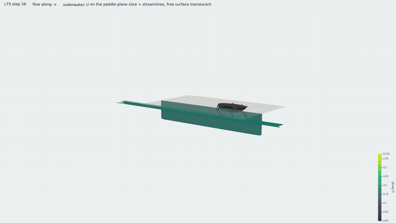 
  Whole-robot OpenFOAM simulation of BODY2 at rest.

  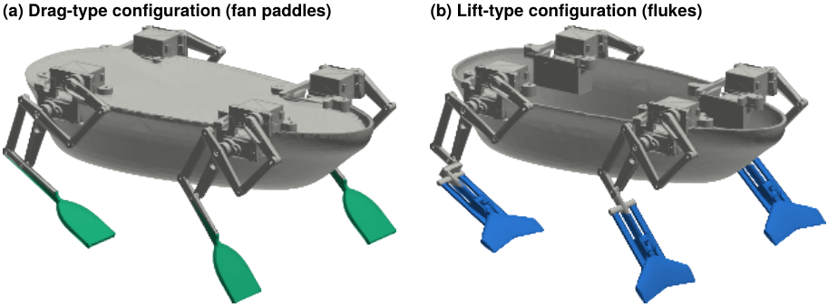 
  (a) Drag-type configuration with folding fan paddles. (b) Lift-type configuration with flukes.

### Key findings

| Research question | Answer | Key numbers |
|---|---|---|
| RQ1: Which mechanism does the optimizer select? | Lift, whenever the model contains it | Unless lift is suppressed, all 101 feasible optima are lift-propelled. Drag-based strokes need 2–3× the power across models, 4–10× within the lift model |
| RQ2: How do drag and lift compare across speed? | Paddle at low speed, fluke at cruising speed | At rest 73–83 vs 45.5 mN per leg, equal thrust per area. Thrust crosses over at 0.24 ± 0.02 m/s, efficiency at 0.22 ± 0.02 m/s. Paddle thrust vanishes near 0.30 m/s. Scheduled pitch raises ηF at 0.30 m/s from 0.24 to 0.40 |
| RQ3: What does this mean for the whole robot? | Fluke slightly faster and much more economical; paddle accelerates faster | 0.30 vs 0.26–0.27 m/s at 42 vs 73 mW (−43 %). Current gait about 0.09 m/s. t90 0.68 vs 1.46–1.57 s. Hardware at 2 Hz is 1.3–1.6× slower than predicted, so the estimate is an upper bound |

Recommendation: for surface swimming, the fluke with a pitch amplitude that decreases with speed is the better propulsor for cruising. The folding paddle is better for starting and low-speed manoeuvring, but only with a fold that narrows to about 12 mm and can be switched at a specific phase.

结论：巡航用尾鳍（俯仰幅度随速度减小），比优化后的扇形桨快一点、省 43 % 功率；起步和低速机动用折叠扇形桨（收拢到约 12 mm，并在指定相位切换开合）。首次实机测试比预测慢 1.3–1.6 倍，预测速度应视为上限。

---

### 1. The optimizer selects lift

  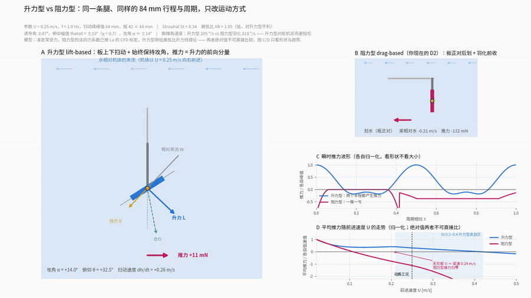

In the reduced-order MuJoCo model (Morison-type link forces, servo speed limit, CMA-ES), every feasible optimized gait is lift-propelled as soon as the model contains lift. At equal speed, the lift gaits need one half to one third of the power of the best gaits of a drag-only model.

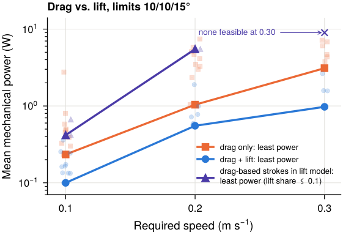

### 2. Designing the paddle stroke

<table>
<tr>
<td width="50%">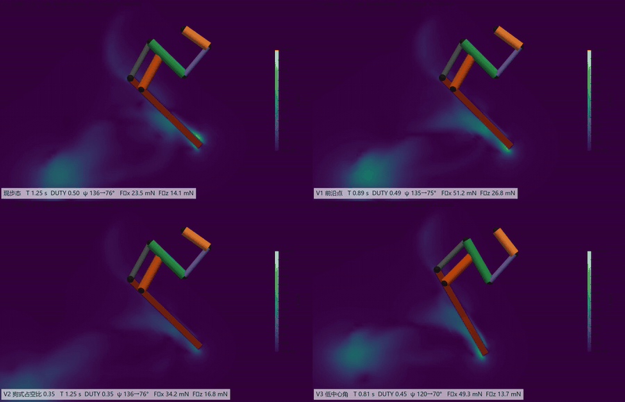</td>
<td width="50%">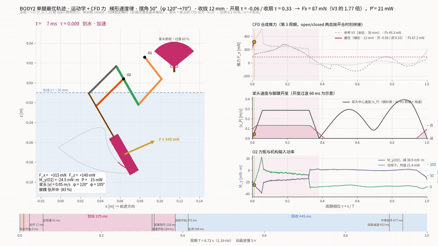</td>
</tr>
<tr>
<td>Single-leg overset CFD: the robot's current stroke and three redesigns.</td>
<td>Optimized stroke V3trap: kinematics and CFD force over one cycle.</td>
</tr>
</table>

A trapezoidal velocity law, a 12 mm folded width and closing the fan at the start of the deceleration raise the thrust at rest from 23.4 mN (current gait) to 73–83 mN per leg. The range bounds the change of added mass at the fold, which the two-state model of the folding fan does not resolve.

### 3. Drag versus lift across speed

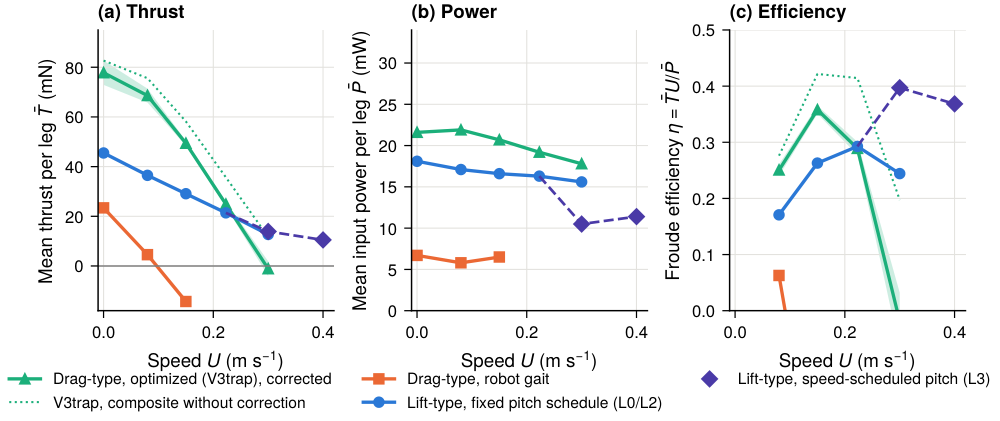

The paddle loses its thrust near 0.30 m/s, because its recovery drag and the cost of opening the fan in the oncoming flow grow while its power-stroke thrust decays. The fluke produces the same thrust per area at rest and loses it more slowly with speed.

### 4. The fluke and its pitch schedule

<table>
<tr>
<td width="50%">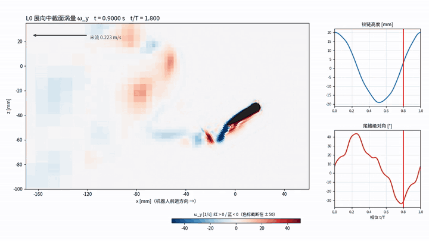</td>
<td width="50%">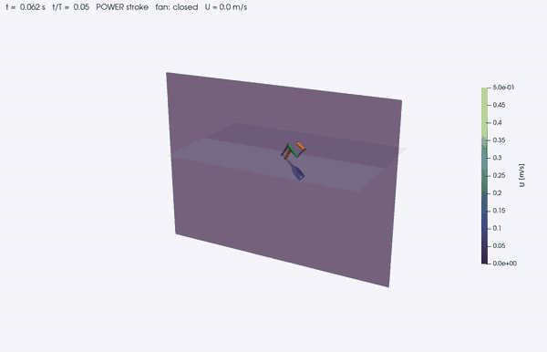</td>
</tr>
<tr>
<td>Spanwise vorticity in the fluke's mid-span plane (L0, U = 0.223 m/s): a reverse von Kármán street.</td>
<td>For comparison: the folding paddle in its recovery stroke, fan closed.</td>
</tr>
</table>

Scheduling the fluke pitch with speed keeps the angle of attack near 20° and raises the Froude efficiency at 0.30 m/s from 0.24 to 0.40.

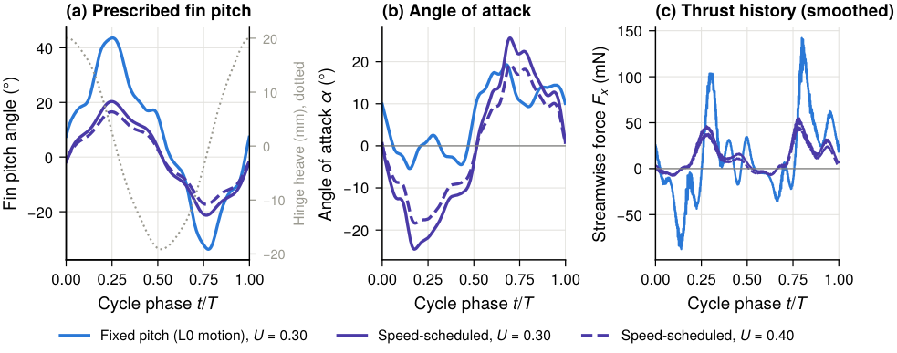

### 5. Self-propulsion of the whole robot

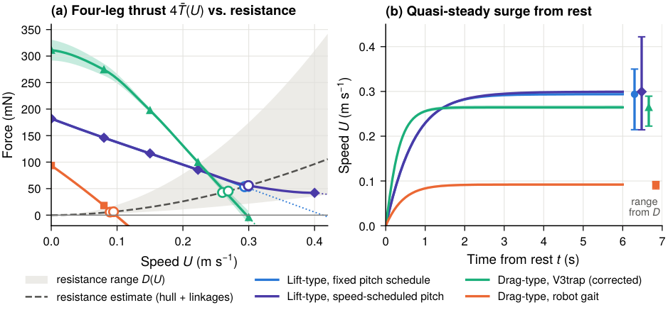

| Propulsor | Cruising speed (m/s) | 4-leg power (mW) | t90 (s) |
|---|---|---|---|
| Drag, current robot gait | 0.089–0.095 | 23.3 | 0.94–0.99 |
| Drag, optimized V3trap | 0.260–0.269 | 73–74 | 0.67–0.69 |
| Lift, fixed pitch | 0.294 | 62.7 | 1.46 |
| Lift, scheduled pitch | **0.299** | **42.0** | 1.57 |

Hull shape study (bare-hull resistance at 0.2 m/s)

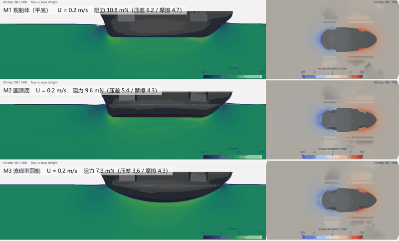

Current flat hull (M1) 10.8 mN, round bottom (M2) 9.6 mN, streamlined (M3) 7.9 mN.

### 6. First hardware test

  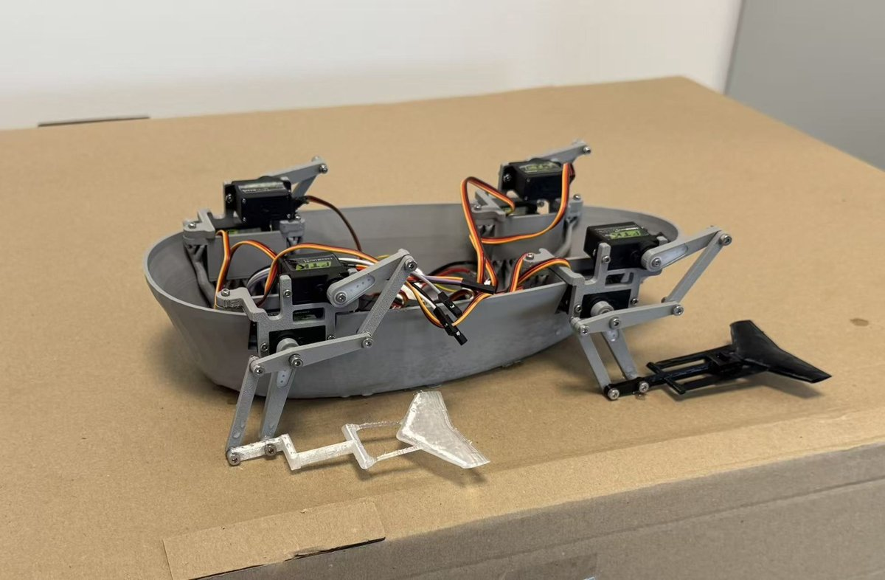 
  BODY2 prototype with printed fluke feet; each leg is driven by two PTK 7465W servos.

The robot with flukes was timed over 0.738 m from rest in a 1 m pool:

| | Frequency set (Hz) | Time (s) | Mean speed (m/s) |
|---|---|---|---|
| Hardware | 2 | 5.2 | 0.142 |
| Hardware | 4 | 2.8 | 0.264 |
| Model, Dlow / Dmid / Dup | 2 | 2.9 / 3.2 / 3.9 | 0.25 / 0.23 / 0.19 |

At 2 Hz the hardware needs 1.3–1.6 times as long as predicted. Between Dmid and Dup the run is reproduced with 27–47 % of the CFD thrust. Possible causes the test cannot separate are the unverified passive-pitch spring, ventilation, the reversed hull, and leg interaction. The predicted cruising speeds are therefore upper bounds for the present hardware.

### 7. Verification and validation

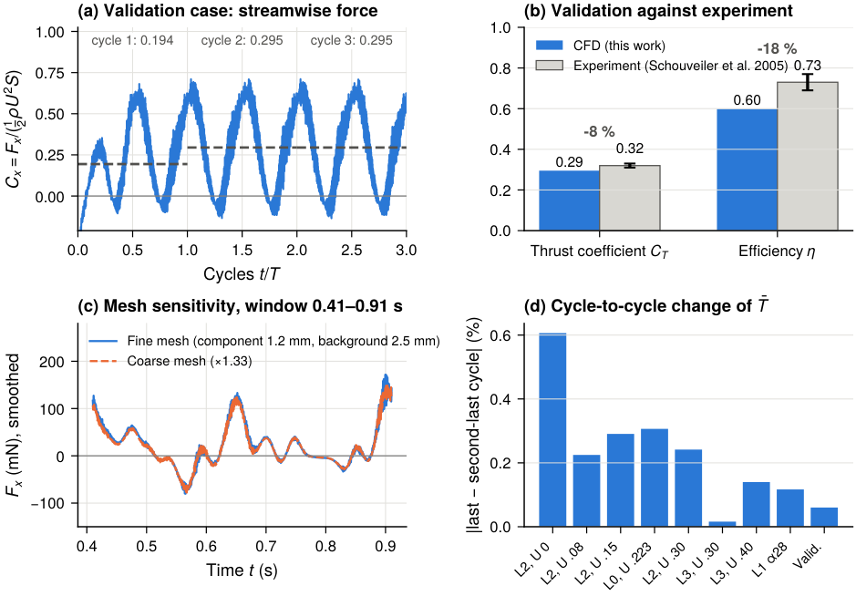

The CFD set-up reproduces the thrust coefficient of the flapping-foil experiment of Schouveiler et al. (2005) to within 8 %, with about ±12 % discretization uncertainty in thrust. Flare Live does not resolve the foil and underpredicts the fluke thrust, so it is used for trends only.

---

### Repository layout

| Path | Contents |
|---|---|
| `thesis/` | LaTeX source (`main.tex`, `chapters/`, `front/`, `figures/`, `refs.bib`), Chinese version (`zh/`), MuJoCo chapter preview. Build with `latexmk -pdf main.tex`. |
| `code/swimopt/` | MuJoCo + CMA-ES gait optimizer, including `results_thesis/`. Public release: [lxtuni/swimopt](https://github.com/lxtuni/swimopt). |
| `cfd/robot_real/` | OpenFOAM case generators (`leg_dynamics/make_leg_cfd.py`, `make_fluke_cfd.py`, `make_full_cfd.py`), force analysis, hull study, cloud run scripts, fluke part scripts. |
| `cfd/cases/` | Per-case setups from `~/run` (OpenFOAM v2606, `overPimpleDyMFoam`): `system/`, `constant/` (no `polyMesh`), `0.orig/`, `Allrun`, `gait.json`, mesh logs, `postProcessing/forces`. |
| `cfd/robot_simple/`, `cfd/dtc_template/`, `cfd/*.py`, `cfd/*.sh` | Early whole-robot resistance cases and setup scripts. |
| `docs/media/` | Animations and figures on this page. |
| `legacy/webots_swim/` | Superseded Webots implementation, without meshes. |

Not included: copyrighted journal papers; internal notes and progress reports; BODY2 CAD (URDF/MJCF models, meshes, STL/STEP; the part-generating scripts are included); mesh and field data, videos, archives; the `mjenv/` virtual environment. Full CFD data (~145 GB) stays in WSL `~/run`.
